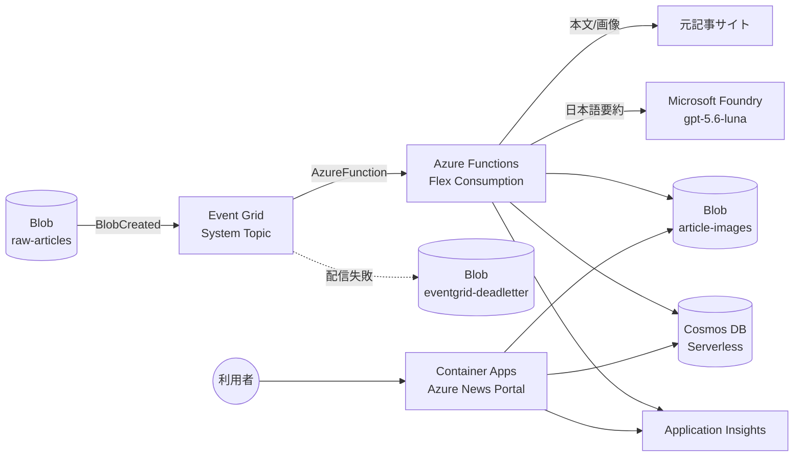

# Azure News Portal

Azure に関する最新記事を自動的に取り込み、**日本語で要約・分類・タグ付け**し、
モダンな Web ポータルで閲覧・検索・フィルターできるシステムです。

Blob Storage に保存された記事 JSON を起点に、Event Grid → Azure Functions →
Microsoft Foundry Models → Cosmos DB のイベント駆動パイプラインで処理し、
Azure Container Apps 上の Web ポータルで配信します。

---

## 目次

1. [システム概要](#1-システム概要)
2. [アーキテクチャ](#2-アーキテクチャ)
3. [リポジトリ構成](#3-リポジトリ構成)
4. [前提条件](#4-前提条件)
5. [クイックスタート](#5-クイックスタート)
6. [デプロイ手順 (詳細)](#6-デプロイ手順-詳細)
7. [動作確認](#7-動作確認)
8. [Application Insights でのログ確認](#8-application-insights-でのログ確認)
9. [モデルの切り替え](#9-モデルの切り替え)
10. [モデルのリージョンとクォータ確認](#10-モデルのリージョンとクォータ確認)
11. [運用: 再処理とバックフィル](#11-運用-再処理とバックフィル)
12. [ローカル開発とテスト](#12-ローカル開発とテスト)
13. [リソース削除](#13-リソース削除)
14. [想定コストの主要因](#14-想定コストの主要因)
15. [既知の制約](#15-既知の制約)
16. [トラブルシューティング](#16-トラブルシューティング)

---

## 1. システム概要

### 処理の流れ

1. Azure Blob Storage の `raw-articles` コンテナーに記事 JSON が保存される (**本リポジトリの対象外**)
2. Azure Event Grid が `BlobCreated` を検知する
3. Event Grid が Azure Functions (Flex Consumption / Python) を起動する
4. Function が Blob を取得し、内部モデルへ正規化する
5. 本文や画像が不足していれば元記事を安全に取得して補完する
6. Microsoft Foundry Models (既定 `gpt-5.6-luna`) が日本語要約・要点・タグ・重要度を生成する
7. 重要画像を `article-images` コンテナーへ保存し、記事を Cosmos DB for NoSQL へ冪等に upsert する
8. Azure Container Apps 上の **Azure News Portal** が Cosmos DB の記事を表示する

### 主な特徴

- **完全サーバーレス**: Functions は Flex Consumption、Cosmos DB は Serverless、
  Container Apps は Consumption workload profile でスケールゼロ
- **サービス間はキーレス**: Azure サービス間認証は Managed Identity + Microsoft Entra ID。
  外部の GitHub Actions から記事を投入する Storage 接続文字列は別途管理します
- **完全 IaC**: すべての Azure リソースを Bicep で構築。Azure Portal での手動作成は不要
- **冪等**: 同じ記事を何度処理しても重複レコードは作られません
- **モデル差し替え可能**: モデル名・デプロイ名・API バージョン・API スタイルをすべて設定で切り替え

### 対象外

Azure Feed リポジトリの fork、GitHub Actions の変更、RSS 収集、サイトのスクレイピング、
GitHub Webhook、Blob Storage へのアップロード処理は本リポジトリの対象外です
(別途完了済みという前提)。ただし入力 JSON のスキーマが確定していない場合に備え、
**入力スキーマの検証と変換層は実装済み**です。

---

## 2. アーキテクチャ



構築されるリソース:

| リソース | 種類 | 主な設定 |
|---------|------|---------|
| Log Analytics Workspace | 監視 | 保持 30 日 |
| Application Insights | 監視 | ワークスペースベース |
| Storage Account | StorageV2 | 共有キー有効、TLS 1.2+、6 コンテナー |
| Event Grid System Topic + Subscription | イベント | BlobCreated / 入力コンテナー限定 / デッドレター |
| Azure Functions Plan + App | FC1 (Flex Consumption) | Linux / Python 3.11 |
| Microsoft Foundry (AI Services) + Project | AI | ローカル認証無効、コンテンツフィルター有効 |
| Foundry Model Deployment | AI | 既定 `gpt-5.6-luna` / Standard Global |
| Cosmos DB for NoSQL | データベース | Serverless、ローカル認証無効、2 コンテナー |
| Container Registry | コンテナー | Basic、管理者ユーザー無効 |
| Container Apps Environment + App | コンテナー | Consumption、スケールゼロ、パブリック HTTPS |
| ユーザー割り当てマネージド ID × 2 | ID | Function 用 / Portal 用 |
| ロール割り当て | RBAC | 最小権限 (詳細は architecture.md) |

設計の詳細は **[architecture.md](architecture.md)**、未確定事項は
**[docs/assumptions.md](docs/assumptions.md)** を参照してください。

---

## 3. リポジトリ構成

```
azure-news-portal/
├── infra/                        # Infrastructure as Code (Bicep)
│   ├── main.bicep                # エントリーポイント
│   ├── main.bicepparam           # 開発環境用パラメーター
│   └── modules/
│       ├── monitoring.bicep      # Log Analytics / Application Insights
│       ├── storage.bicep         # Storage Account + コンテナー
│       ├── functions.bicep       # Flex Consumption Function App
│       ├── event-grid.bicep      # System Topic + Event Subscription
│       ├── foundry.bicep         # Foundry アカウント / プロジェクト / モデル
│       ├── cosmos-db.bicep       # Cosmos DB Serverless
│       ├── container-registry.bicep
│       ├── container-apps.bicep  # 環境 + Azure News Portal
│       └── role-assignments.bicep
├── functions/                    # 記事処理パイプライン
│   ├── function_app.py           # Event Grid Trigger (Python v2 model)
│   ├── host.json
│   ├── requirements.txt
│   ├── src/newsproc/
│   │   ├── adapters.py           # 入力 JSON → 内部モデル
│   │   ├── blobs.py              # Blob アクセス
│   │   ├── bootstrap.py          # 依存関係の組み立て
│   │   ├── config.py             # 環境変数からの設定
│   │   ├── fetcher.py            # 安全な外部取得 (SSRF 対策)
│   │   ├── foundry.py            # モデル呼び出しの抽象化
│   │   ├── htmlx.py              # HTML サニタイズ / 本文抽出
│   │   ├── images.py             # 画像候補の選別と保存
│   │   ├── logging_utils.py      # 構造化ログ
│   │   ├── models.py             # 内部モデル / 出力スキーマ
│   │   ├── pipeline.py           # オーケストレーション
│   │   ├── prompts.py            # プロンプト (インジェクション対策)
│   │   ├── repository.py         # Cosmos DB
│   │   └── urls.py               # URL 正規化 / 記事 ID / SSRF 判定
│   └── tests/
├── portal/                       # Azure News Portal (FastAPI)
│   ├── Dockerfile                # 非 root / マルチステージ
│   ├── requirements.txt
│   ├── app/
│   │   ├── main.py               # ルーティング / セキュリティヘッダー
│   │   ├── config.py
│   │   ├── dependencies.py
│   │   ├── media.py              # 画像配信
│   │   ├── models.py             # ビューモデル / 検索条件
│   │   ├── repository.py         # Cosmos / インメモリ実装
│   │   └── search.py             # クエリ生成 (AI Search 移行を想定した抽象化)
│   ├── templates/
│   ├── static/
│   └── tests/
├── shared/newsportal_shared/     # Functions と Portal が共有するスキーマ
├── scripts/                      # デプロイ・運用スクリプト (Bash / PowerShell)
├── samples/
│   ├── articles/                 # 入力 Blob のサンプル
│   └── cosmos/articles.json      # Portal オフラインモード用サンプル
├── docs/
│   ├── assumptions.md            # 前提と未確定事項
│   └── operations.md             # 運用手順
├── architecture.md
├── pyproject.toml
├── requirements-dev.txt
└── README.md
```

---

## 4. 前提条件

### ツール

| ツール | 必要バージョン | 確認コマンド |
|-------|--------------|-------------|
| Azure CLI | 2.60.0 以上 (推奨 2.70+) | `az version` |
| Bicep CLI | 0.30.0 以上 | `az bicep version` |
| Python | 3.11 または 3.12 (ローカルテスト用) | `python3 --version` |
| Bash | 5.x (Linux / macOS) | `bash --version` |
| PowerShell | 7.4 以上 (Windows 版スクリプト使用時) | `pwsh --version` |
| zip | 任意 | `zip -v` |

Docker は不要です (`az acr build` でクラウド側ビルドを行います)。

```bash
az upgrade                # Azure CLI の更新
az bicep install          # Bicep CLI のインストール
az bicep upgrade          # Bicep CLI の更新
```

### Azure サブスクリプションの権限

Bicep はロール割り当ても作成するため、**Contributor だけでは不足**します。
デプロイ主体には以下のいずれかが必要です。

| 選択肢 | 必要なロール | スコープ |
|-------|-------------|---------|
| 推奨 | `Owner` | リソースグループ |
| 代替 | `Contributor` + `User Access Administrator` | リソースグループ |
| 最小 | `Contributor` + `Role Based Access Control Administrator` | リソースグループ |

加えて次の操作権限が必要です。

- リソースグループの作成 (サブスクリプションスコープの `Contributor` など)
- `Microsoft.CognitiveServices` / `Microsoft.App` / `Microsoft.DocumentDB` /
  `Microsoft.EventGrid` リソースプロバイダーの登録
- Cosmos DB のデータプレーンロール割り当て (`sqlRoleAssignments`) — 上記ロールに含まれます
- Foundry のモデルクォータ (README 10 章)

プロバイダー登録:

```bash
for ns in Microsoft.CognitiveServices Microsoft.App Microsoft.DocumentDB \
          Microsoft.EventGrid Microsoft.OperationalInsights Microsoft.Insights \
          Microsoft.ContainerRegistry Microsoft.Web Microsoft.Storage; do
  az provider register --namespace "$ns" --wait
done
```

---

## 5. クイックスタート

```bash
# 1. Azure へログイン
az login
az account set --subscription "<サブスクリプション ID または名前>"

# 2. 環境設定 (任意。既定値のままでも動作します)
cat > .env <<'EOF'
AZURE_ENV_NAME=dev
AZURE_NAME_PREFIX=newsportal
AZURE_LOCATION=japaneast
AZURE_FOUNDRY_LOCATION=eastus2
AZURE_RESOURCE_GROUP=rg-newsportal-dev
EOF

# 3. すべてデプロイ (インフラ → Function → Event Grid → Portal → 動作確認)
./scripts/deploy-all.sh

# 4. サンプル記事を投入
./scripts/upload-samples.sh

# 5. Portal を開く
python3 -c "import json;print(json.load(open('azure-outputs.json'))['portalUrl']['value'])"
```

PowerShell の場合:

```powershell
az login
./scripts/Deploy-All.ps1
./scripts/Upload-Samples.ps1
```

---

## 6. デプロイ手順 (詳細)

`deploy-all.sh` は以下を順に実行します。個別に実行することもできます。
すべてのスクリプトは**再実行可能 (冪等)** です。

### 6.1 Azure へのログインとサブスクリプション選択

```bash
az login
az account list --output table
az account set --subscription "<サブスクリプション ID>"
az account show --output table
```

### 6.2 リソースグループの作成

`deploy-infra.sh` が自動作成しますが、手動で作る場合:

```bash
az group create --name rg-newsportal-dev --location japaneast
```

### 6.3 Bicep の検証と What-If

```bash
# lint / build のみ
az bicep build --file infra/main.bicep --stdout > /dev/null
az bicep build-params --file infra/main.bicepparam --stdout > /dev/null

# validate + what-if のみ実行 (デプロイしない)
./scripts/deploy-infra.sh --validate-only
```

手動で what-if を実行する場合:

```bash
az deployment group what-if \
  --resource-group rg-newsportal-dev \
  --name newsportal-dev \
  --template-file infra/main.bicep \
  --parameters infra/main.bicepparam
```

### 6.4 インフラのデプロイ (フェーズ 1)

```bash
./scripts/deploy-infra.sh
```

この時点では Event Grid Event Subscription は作成されず、Container App は
プレースホルダーイメージで起動します (宛先の Function とコンテナーイメージが未作成のため)。

デプロイ出力は `azure-outputs.json` と `.deploy-outputs.env` に保存されます。

### 6.5 Function コードのデプロイ (フェーズ 2)

```bash
./scripts/deploy-functions.sh
```

`functions/` と `shared/newsportal_shared/` を zip 化し、
`az functionapp deploy --type zip` で Flex Consumption へデプロイします。
リモートビルド (pip install) が完了し `ProcessArticleBlob` が登録されるまで待機します
(初回は 3〜8 分程度かかります)。

### 6.6 Event Grid Subscription の有効化 (フェーズ 3)

```bash
./scripts/configure-event-grid.sh
```

`ProcessArticleBlob` の存在を確認したうえで、`deployEventGridSubscription=true` として
テンプレートを再適用します。フィルター条件、再試行ポリシー、デッドレター設定が構成されます。

### 6.7 ACR へのコンテナーイメージ build と push / Container App の更新 (フェーズ 4)

```bash
./scripts/deploy-portal.sh
```

`az acr build` でクラウド側ビルドを行い (ローカル Docker 不要)、
`portalImage` パラメーター付きでテンプレートを再適用します。
これにより ACR からの Managed Identity 取得、環境変数、ヘルスプローブが構成されます。

イメージタグを固定する場合:

```bash
PORTAL_IMAGE_TAG=v1.0.0 ./scripts/deploy-portal.sh
```

### 6.8 サンプル記事 Blob のアップロード

```bash
# samples/articles 配下をすべて
./scripts/upload-samples.sh

# 1 件だけ
./scripts/upload-samples.sh samples/articles/2026/09/02/foundry-agent-observability-preview.json
```

---

## 7. 動作確認

### 7.1 自動確認

```bash
./scripts/verify-deployment.sh
```

Function の状態、`ProcessArticleBlob` の登録、Event Grid Subscription、
入力 Blob / 画像 Blob の件数、Cosmos DB の成功 / 失敗件数、Portal の各エンドポイントを確認します。

### 7.2 手動確認

```bash
RG=rg-newsportal-dev
OUT() { python3 -c "import json,sys;print(json.load(open('azure-outputs.json'))['$1']['value'])"; }

# Cosmos DB に記事が保存されたか
az cosmosdb sql container query \
  --account-name "$(OUT cosmosAccountName)" --resource-group "$RG" \
  --database-name "$(OUT cosmosDatabaseName)" --name "$(OUT cosmosArticlesContainerName)" \
  --query-text "SELECT c.id, c.titleJa, c.importance, c.processingStatus FROM c ORDER BY c.publishedAt DESC" \
  -o table

# 処理済み画像
az storage blob list --account-name "$(OUT storageAccountName)" \
  --container-name "$(OUT imagesContainerName)" --auth-mode login -o table

# Portal
curl -fsS "$(OUT portalUrl)/healthz"
curl -fsS "$(OUT portalUrl)/readyz"
curl -fsS "$(OUT portalUrl)/api/articles?size=3" | head -c 500
```

### 7.3 Azure News Portal へのアクセス

```bash
python3 -c "import json;print(json.load(open('azure-outputs.json'))['portalUrl']['value'])"
```

ブラウザーで表示される内容:

- 最新記事の大きな強調カード (「最新」バッジ付き)
- 可変グリッドの記事カード (日本語タイトル、要約、情報源、公開日時、製品タグ、重要度、元記事リンク)
- 上部の検索窓と絞り込み (Azure 製品 / カテゴリ / タグ / 重要度 / 情報源 / 公開日範囲)
- カードをクリックすると記事詳細 (要点、画像、用語、対象読者、重要度の理由、元記事リンク)
- 「さらに読み込む」によるページング
- ライト / ダークテーマ切り替え

**初回アクセスはスケールゼロからの起動のため数秒かかります。**

---

## 8. Application Insights でのログ確認

```bash
APPI=$(python3 -c "import json;print(json.load(open('azure-outputs.json'))['applicationInsightsName']['value'])")
```

Azure CLI からクエリを実行 (`application-insights` 拡張が必要):

```bash
az extension add --name application-insights --upgrade
az monitor app-insights query --app "$APPI" --resource-group rg-newsportal-dev \
  --analytics-query "traces | where message has 'article.' | order by timestamp desc | take 50"
```

### 便利な KQL

```kusto
// 記事処理の成否サマリー
traces
| where message has "article.processing.completed" or message has "article.processing.failed"
| extend payload = parse_json(message)
| summarize count() by tostring(payload.event), bin(timestamp, 1h)

// 失敗した記事の詳細
traces
| where message has "article.processing.failed"
| extend p = parse_json(message)
| project timestamp, blobPath = tostring(p.blobPath), errorType = tostring(p.errorType),
          errorMessage = tostring(p.errorMessage), eventId = tostring(p.eventId)
| order by timestamp desc

// Foundry 呼び出しの所要時間とトークン数
traces
| where message has "foundry.completed"
| extend p = parse_json(message)
| project timestamp, deployment = tostring(p.deployment), durationMs = todouble(p.durationMs),
          promptTokens = toint(p.promptTokens), completionTokens = toint(p.completionTokens),
          attempts = toint(p.attempts)
| summarize avg(durationMs), percentile(durationMs, 95), sum(promptTokens), sum(completionTokens)
    by deployment, bin(timestamp, 1d)

// 画像取得の成功 / 失敗
traces
| where message has "article.succeeded"
| extend p = parse_json(message)
| summarize downloaded = sum(toint(p.imagesDownloaded)), failed = sum(toint(p.imagesFailed))
    by bin(timestamp, 1d)

// Event Grid のイベント ID で処理を追跡
traces
| where message has "<Event Grid の event id>"
| order by timestamp asc

// 依存関係 (Foundry / Cosmos DB / 外部サイト) の相関
dependencies
| where cloud_RoleName has "func-newsportal"
| summarize count(), avg(duration) by type, target, success
```

**記事本文、モデルの入出力全体、秘密情報はログに記録されません。**
キー名に `key` / `secret` / `token` / `password` / `credential` / `authorization` / `sas` を
含む値は自動的に `[redacted]` に置換されます。

---

## 9. モデルの切り替え

モデル名はコードにハードコードされていません。次の 2 段階で切り替えます。

### 9.1 モデルデプロイの変更 (Bicep)

`.env` に環境変数を設定して再デプロイします (`infra/main.bicepparam` が読み取ります)。

```bash
cat >> .env <<'EOF'
FOUNDRY_MODEL_NAME=gpt-4.1
FOUNDRY_MODEL_VERSION=2025-04-14
FOUNDRY_DEPLOYMENT_NAME=gpt-41
FOUNDRY_DEPLOYMENT_SKU=GlobalStandard
FOUNDRY_DEPLOYMENT_CAPACITY=100
FOUNDRY_API_VERSION=2024-10-21
FOUNDRY_API_STYLE=chat
FOUNDRY_REASONING_EFFORT=
EOF

./scripts/deploy-infra.sh --skip-what-if
```

`FOUNDRY_MODEL_VERSION` を空にすると `model.version` を送信せず、サービス側の既定バージョンが使われます。

### 9.2 アプリ設定のみの変更 (既存デプロイを使う場合)

```bash
FUNC=$(python3 -c "import json;print(json.load(open('azure-outputs.json'))['functionAppName']['value'])")
az functionapp config appsettings set -g rg-newsportal-dev -n "$FUNC" --settings \
  FOUNDRY_MODEL_DEPLOYMENT=gpt-41 \
  FOUNDRY_API_VERSION=2024-10-21 \
  FOUNDRY_API_STYLE=chat \
  FOUNDRY_REASONING_EFFORT= \
  FOUNDRY_MAX_OUTPUT_TOKENS=4000
```

### 9.3 切り替え可能な設定一覧

| 環境変数 | 既定値 | 説明 |
|---------|-------|------|
| `FOUNDRY_ENDPOINT` | Bicep 出力 | Foundry アカウントのエンドポイント |
| `FOUNDRY_PROJECT_ENDPOINT` | Bicep 出力 | Foundry プロジェクトのエンドポイント |
| `FOUNDRY_MODEL_DEPLOYMENT` | `gpt-5-6-luna` | モデルデプロイ名 |
| `FOUNDRY_API_VERSION` | `2025-04-01-preview` | 推論 API バージョン |
| `FOUNDRY_API_STYLE` | `chat` | `chat` (Chat Completions) / `responses` (Responses API) |
| `FOUNDRY_REASONING_EFFORT` | `low` | `minimal`/`low`/`medium`/`high`。空で無効化 |
| `FOUNDRY_MAX_OUTPUT_TOKENS` | `4000` | 最大出力トークン |
| `FOUNDRY_TIMEOUT_SECONDS` | `120` | タイムアウト秒 |
| `FOUNDRY_MAX_RETRIES` | `3` | 最大リトライ回数 |
| `FOUNDRY_TEMPERATURE` | 未設定 | 設定時のみ送信 |

モデルがパラメーターに対応していない場合は、エラーメッセージから自動検出して
そのパラメーターを無効化し再試行します。`json_schema` 非対応時は `json_object` へ
フォールバックし、いずれの場合も Pydantic で出力を検証します。
**モデルを変更しても Function のビジネスロジックを変更する必要はありません。**

---

## 10. モデルのリージョンとクォータ確認

`gpt-5.6-luna` が対象リージョンで提供されていない場合、モデルデプロイの作成に失敗します。
デプロイ前に必ず確認してください。

### 10.1 リージョンで利用可能なモデルを一覧表示

```bash
LOCATION=eastus2

# 指定リージョンで提供されているモデルとデプロイ可能な SKU
az cognitiveservices model list --location "$LOCATION" \
  --query "[?kind=='AIServices'].{model:model.name, version:model.version, skus:model.skus[].name}" \
  -o table

# 特定モデル名で絞り込み
az cognitiveservices model list --location "$LOCATION" \
  --query "[?contains(model.name, 'gpt-5')].{model:model.name, version:model.version, format:model.format, skus:model.skus[].name}" \
  -o json
```

### 10.2 クォータ (容量) の確認

```bash
az cognitiveservices usage list --location "$LOCATION" \
  --query "[?contains(name.value, 'OpenAI')].{name:name.value, current:currentValue, limit:limit}" \
  -o table
```

`foundryDeploymentCapacity` (既定 50 = 50,000 TPM) が残容量を超えるとデプロイに失敗します。
`FOUNDRY_DEPLOYMENT_CAPACITY` で調整してください。

### 10.3 提供されていない場合の対処

1. **別リージョンを試す**: `AZURE_FOUNDRY_LOCATION` を変更 (Foundry のみ別リージョンに配置できます)

   ```bash
   AZURE_FOUNDRY_LOCATION=swedencentral ./scripts/deploy-infra.sh
   ```

2. **SKU を変更する**: `FOUNDRY_DEPLOYMENT_SKU=DataZoneStandard` または `Standard`

3. **モデルを差し替える**: 9 章の手順で `FOUNDRY_MODEL_NAME` / `FOUNDRY_DEPLOYMENT_NAME` を変更

**Bicep のテンプレート本体を書き換える必要はありません。**
モデルの選択はすべてパラメーター経由で差し替えられる構成になっています。

---

## 11. 運用: 再処理とバックフィル

管理用の再処理 API はパブリックに公開していません。以下の CLI スクリプトを使用します。

### 11.1 失敗記事の再処理

```bash
# Cosmos DB で processingStatus = 'failed' の記事のみ
./scripts/reprocess.sh --failed

# 特定のプレフィックス配下
./scripts/reprocess.sh --prefix articles/2026/08

# 単一 Blob
./scripts/reprocess.sh --blob articles/2026/08/28/azure-container-apps-serverless-gpu-ga.json

# 実行内容の確認のみ
./scripts/reprocess.sh --all --dry-run
```

内容が変わっていない記事は `contentHash` により再処理がスキップされます。
**強制的に全記事を再処理する**場合は、`processingVersion` を変更してから実行します。

```bash
FUNC=$(python3 -c "import json;print(json.load(open('azure-outputs.json'))['functionAppName']['value'])")
az functionapp config appsettings set -g rg-newsportal-dev -n "$FUNC" \
  --settings PROCESSING_VERSION=1.1.0
./scripts/reprocess.sh --all
```

### 11.2 過去 Blob のバックフィル

```bash
# 期間指定 (パスの YYYY/MM に基づく)
./scripts/backfill.sh --from 2026-01 --to 2026-09

# 全件。20 件ごとに 30 秒待機してスロットリングを回避
./scripts/backfill.sh --all --batch-size 20 --delay 30

# 対象確認のみ
./scripts/backfill.sh --all --dry-run
```

### 11.3 デッドレターの確認

```bash
ST=$(python3 -c "import json;print(json.load(open('azure-outputs.json'))['storageAccountName']['value'])")
az storage blob list --account-name "$ST" --container-name eventgrid-deadletter \
  --auth-mode login -o table
```

その他の運用手順は [docs/operations.md](docs/operations.md) を参照してください。

---

## 12. ローカル開発とテスト

```bash
# 仮想環境
python3 -m venv .venv
source .venv/bin/activate          # Windows: .venv\Scripts\Activate.ps1
pip install -r requirements-dev.txt

# 全テスト (Unit / Integration / UI)
pytest

# 種類別
pytest functions/tests             # Unit + Integration
pytest portal/tests                # API + UI
pytest -m integration              # 統合テストのみ
pytest -m ui                       # UI テストのみ

# Lint
ruff check .
```

テストは Azure へ一切接続しません。外部サービスはすべてテストダブルに置き換えています。

### Portal をローカルで起動

```bash
export PORTAL_OFFLINE_MODE=1        # samples/cosmos/articles.json を使用
export PYTHONPATH="$PWD/shared:$PWD/portal"
uvicorn app.main:app --reload --port 8000 --app-dir portal
# http://127.0.0.1:8000
```

### コンテナーをローカルでビルド (Docker がある場合)

```bash
docker build -f portal/Dockerfile -t azure-news-portal .
docker run --rm -p 8000:8000 -e PORTAL_OFFLINE_MODE=1 azure-news-portal
```

---

## 13. リソース削除

```bash
./scripts/destroy.sh            # リソースグループ名の入力を求められます
./scripts/destroy.sh --yes      # 確認なし
```

PowerShell:

```powershell
./scripts/Destroy.ps1 -Yes
```

リソースグループを削除したうえで、論理削除された Microsoft Foundry アカウントを
`az cognitiveservices account purge` で完全削除します
(purge しないと同じ名前で再作成できません)。

手動で削除する場合:

```bash
az group delete --name rg-newsportal-dev --yes
az cognitiveservices account purge --name <foundry-account-name> \
  --resource-group rg-newsportal-dev --location eastus2
```

---

## 14. 想定コストの主要因

| リソース | 課金モデル | 主なコストドライバー |
|---------|-----------|-------------------|
| **Microsoft Foundry** | トークン従量課金 | **最大の変動要因**。記事数 × (入力 + 出力トークン)。本文は 12,000 文字で切り詰め |
| Cosmos DB Serverless | 消費 RU + ストレージ | 記事数、クロスパーティションクエリ、Portal のアクセス数 |
| Azure Functions Flex Consumption | 実行時間 × メモリ | 記事数、元記事取得と画像ダウンロードの待ち時間 |
| Container Apps Consumption | vCPU 秒 / GiB 秒 | Portal のアクセス数。**無アクセス時はスケールゼロで課金なし** |
| Storage | 容量 + トランザクション | 画像 (最大 3 枚/記事) と本文アーカイブ |
| Log Analytics / Application Insights | 取り込み GB | ログ量。サンプリング (20 items/sec) で抑制 |
| Container Registry | Basic 固定費 | イメージ数 |
| Event Grid | 操作数 | 月 10 万操作まで無料枠あり |

コスト抑制の実装:

- Cosmos DB に記事本文や生 HTML を保存せず、Blob へアーカイブして参照のみ保持
- インデックス対象パスを限定 (`/*` を除外)
- 一覧クエリは必要な項目のみ射影
- ファセットを 5 分間メモリキャッシュ
- 未変更記事は `contentHash` で再処理をスキップ (モデル呼び出しが発生しない)
- Portal のスケールゼロ

---

## 15. 既知の制約

- **検索**: Cosmos DB の `CONTAINS` ベースで、形態素解析・関連度ランキング・表記ゆれ吸収は行いません。
  検索処理はリポジトリ層で抽象化済みのため、Azure AI Search への移行が可能です。
- **ファセット**: クロスパーティションの `GROUP BY` クエリのため、記事数増加に伴い RU コストが増えます。
- **Functions のストレージ権限**: Functions ホストの要件により、Blob 権限がアカウントスコープになります
  (詳細は [docs/assumptions.md](docs/assumptions.md) 4 章)。
- **ネットワーク**: パブリック構成です。Private Endpoint / VNet 統合 / NAT Gateway は対象外です。
- **ユーザー認証**: Portal に認証はありません (将来 Entra ID 認証を追加できる構造)。
- **画像**: 元サイトの `alt` 属性を優先し、モデルによる画像内容の説明は生成しません。
- **入力スキーマ**: 実際の入力 JSON を確認できていないため、複数の項目名を許容する
  アダプター方式を採用しています ([docs/assumptions.md](docs/assumptions.md) 2 章)。
- **モデル**: `gpt-5.6-luna` の提供リージョンとパラメーター対応状況は未確認です
  ([docs/assumptions.md](docs/assumptions.md) 3 章)。

---

## 16. トラブルシューティング

### デプロイ

| 症状 | 原因 | 対処 |
|------|------|------|
| `AuthorizationFailed` (ロール割り当て) | デプロイ主体に RBAC 管理権限がない | `Owner` または `User Access Administrator` を付与 (4 章) |
| `PrincipalNotFound` | マネージド ID が Entra ID へ伝播していない | 数分待って `./scripts/deploy-infra.sh` を再実行 |
| `InvalidResourceLocation` (Foundry) | 指定リージョンでモデル未提供 | `AZURE_FOUNDRY_LOCATION` を変更 (10 章) |
| `DeploymentModelNotSupported` / `InvalidResourceProperties` | モデル名・バージョン・SKU が不正 | `az cognitiveservices model list` で確認 (10 章) |
| `InsufficientQuota` | TPM クォータ不足 | `FOUNDRY_DEPLOYMENT_CAPACITY` を下げる、またはクォータ引き上げを申請 |
| `StorageAccountAlreadyTaken` / ACR 名重複 | グローバル一意名の衝突 | `AZURE_NAME_PREFIX` または `AZURE_ENV_NAME` を変更 |
| Foundry アカウントが再作成できない | 論理削除されたアカウントが残存 | `az cognitiveservices account purge` (13 章) |

### Function

| 症状 | 原因 | 対処 |
|------|------|------|
| `ProcessArticleBlob` が表示されない | リモートビルド未完了、または import エラー | 5〜10 分待つ。`az functionapp log deployment show` でビルドログを確認 |
| Event Subscription 作成が失敗 | Function が未登録 | `./scripts/deploy-functions.sh` の完了後に `./scripts/configure-event-grid.sh` |
| Blob を置いても起動しない | フィルター条件の不一致 | 入力コンテナー配下で拡張子が `.json` か確認。Event Subscription の `subjectBeginsWith` を確認 |
| `403 Forbidden` (Blob / Cosmos / Foundry) | ロール割り当ての伝播待ち | 5 分待って再試行。`az role assignment list --assignee <clientId>` で確認 |
| `ImportError: newsportal_shared` | 共有パッケージ未同梱 | `./scripts/deploy-functions.sh` を使用 (手動 zip では `shared/newsportal_shared` を含める) |
| モデル呼び出しが必ず失敗する | パラメーター非対応 | ログの `foundry.parameter.disabled` を確認。`FOUNDRY_REASONING_EFFORT=` で無効化 |
| 記事が `failed` のまま | 正規化エラー | `failed-articles` コンテナーの `*.error.json` を確認 |
| 同じ記事が何度も処理される | `contentHash` が毎回変わる | 入力 JSON に処理ごとに変わる値 (タイムスタンプ等) が本文へ含まれていないか確認 |

```bash
# ビルド / デプロイログ
az functionapp log deployment list -g rg-newsportal-dev -n <function-app>
az functionapp log deployment show -g rg-newsportal-dev -n <function-app>

# アプリ設定の確認
az functionapp config appsettings list -g rg-newsportal-dev -n <function-app> -o table
```

### Portal

| 症状 | 原因 | 対処 |
|------|------|------|
| 502 / コンテナー起動失敗 | イメージ未 push、または環境変数不足 | `./scripts/deploy-portal.sh` を実行 |
| `/readyz` が 503 | Cosmos DB へ接続できない | ロール割り当ての伝播を待つ。`COSMOS_ENDPOINT` を確認 |
| 記事が 0 件 | Cosmos DB にデータがない | `./scripts/upload-samples.sh` を実行し、Function のログを確認 |
| 画像が表示されない | 画像取得に失敗、または Blob 権限不足 | ログの `image.fetch.failed` / `image.skipped` を確認 |
| 初回アクセスが遅い | スケールゼロからのコールドスタート | 仕様。`portalMinReplicas=1` で回避可能 (課金が発生します) |
| プレースホルダー画面が表示される | フェーズ 4 未実施 | `./scripts/deploy-portal.sh` を実行 |

```bash
# コンテナーログ
az containerapp logs show -g rg-newsportal-dev -n <container-app> --tail 100
az containerapp revision list -g rg-newsportal-dev -n <container-app> -o table
```

### 全般

```bash
# デプロイ操作のエラー詳細
az deployment operation group list \
  --resource-group rg-newsportal-dev --name newsportal-dev \
  --query "[?properties.provisioningState=='Failed'].{resource:properties.targetResource.resourceName, message:properties.statusMessage.error.message}" \
  -o json
```
