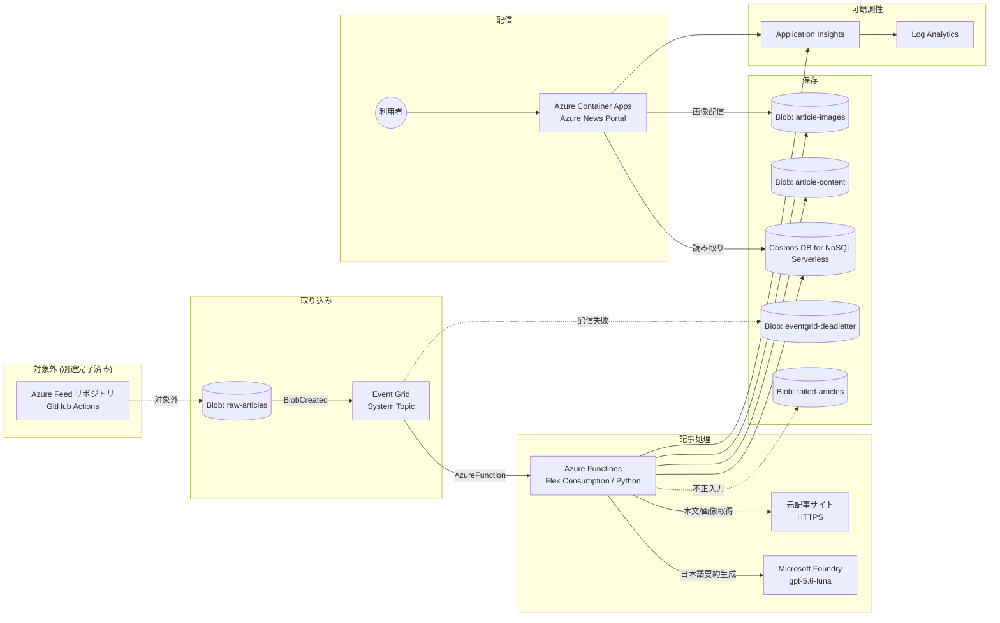

# Azure News Portal アーキテクチャ

本書は Azure News Portal の設計判断、データフロー、スキーマ、権限モデルをまとめたものです。
運用手順は [README.md](README.md)、未確定事項は [docs/assumptions.md](docs/assumptions.md) を参照してください。

---

## 1. システム全体像

すべてのサービス間認証は Managed Identity と Microsoft Entra ID で行い、キーや接続文字列は使用しません。

---

## 2. データフロー

| # | 処理 | 実装 |
|---|------|------|
| 1 | 記事 JSON が `raw-articles` に保存される | 対象外 (別途完了済み) |
| 2 | `Microsoft.Storage.BlobCreated` を Event Grid が検知 | `infra/modules/event-grid.bicep` |
| 3 | `subjectBeginsWith` / `subjectEndsWith` で入力コンテナーの `.json` のみに絞り込み | 同上 |
| 4 | Event Grid Trigger の Function が起動 | `functions/function_app.py` |
| 5 | イベント検証 (種別・コンテナー・拡張子・重複) | `pipeline.handle_event` |
| 6 | Managed Identity で Blob を取得し JSON を解析 | `blobs.BlobStore` |
| 7 | 入力アダプターで内部モデルへ正規化 | `adapters.normalize_input` |
| 8 | 安定した記事 ID と contentHash を計算 | `urls.stable_article_id` / `urls.content_hash` |
| 9 | 既存ドキュメントと比較し、未変更ならスキップ | `pipeline._can_skip` |
| 10 | 本文や画像が不足していれば元記事を取得 (SSRF 対策付き) | `fetcher.fetch_url` / `htmlx.extract_page` |
| 11 | 画像候補をスコアリングし最大 3 枚を保存 | `images.ImageProcessor` |
| 12 | Foundry Models で日本語要約・タグ・重要度を生成 | `foundry.FoundryInsightsGenerator` |
| 13 | 抽出本文を Blob へアーカイブ | `pipeline._archive_body` |
| 14 | Cosmos DB へ upsert (冪等) | `repository.ArticleRepository` |
| 15 | Portal が Cosmos DB を読み取り表示 | `portal/app` |

### 失敗時の流れ

| 失敗の種類 | 再試行 | 保存先 |
|-----------|--------|--------|
| 不正 JSON / 必須項目欠落 | しない (Poison Blob 対策) | `failed-articles` + 構造化ログ |
| Blob 取得失敗 | Event Grid が再試行 | — |
| 元記事取得失敗 | 取得のみ限定再試行。記事処理は継続 | `originalFetchError` メトリック |
| 画像取得失敗 | 該当画像のみスキップ | `imagesFailed` メトリック |
| Foundry 一時エラー (429/5xx/timeout) | 指数バックオフ + Event Grid 再試行 | `processingStatus=failed`, `retryCount` |
| Foundry 恒久エラー (スキーマ違反等) | しない | `processingStatus=failed`, `lastError` |
| Cosmos DB 書き込み失敗 | Event Grid が再試行 | — |
| 再試行上限超過 | 打ち切り | Event Grid デッドレター (`eventgrid-deadletter`) |

`retryCount` が `MAX_PROCESSING_RETRIES` (既定 3) に達すると一時エラーでも例外を送出せず、
Poison Blob が無限に再実行されることを防ぎます。

---

## 3. デプロイフェーズ

Event Grid Event Subscription は宛先の Function が存在しないと作成に失敗します。
また Container App は ACR にイメージが無い状態では正しく起動しません。
このため、単一の Bicep テンプレートを 2 つのパラメーターで段階的に適用します。

| フェーズ | コマンド | `deployEventGridSubscription` | `portalImage` |
|---------|---------|------------------------------|---------------|
| 1. 基盤 | `deploy-infra.sh` | `false` | 空 (プレースホルダー) |
| 2. Function コード | `deploy-functions.sh` | — | — |
| 3. Event Grid | `configure-event-grid.sh` | `true` | 前回値を維持 |
| 4. Portal イメージ + 更新 | `deploy-portal.sh` | `true` | ACR のイメージ |

パラメーター値は `.deploy-outputs.env` に保存され、後続スクリプトが引き継ぎます。
テンプレートは冪等なので、どのスクリプトも何度でも再実行できます。

---

## 4. Managed Identity と RBAC 対応表

ユーザー割り当てマネージド ID を 2 つ作成し、用途を分離しています。

### 4.1 Function 用 ID (`id-func-*`)

| ロール | スコープ | 目的 |
|-------|---------|------|
| Storage Blob Data Contributor | ストレージアカウント | 入力記事の読み取り、画像 / 本文アーカイブの書き込み、Functions ホストが使用する `azure-webjobs-*` コンテナーの作成 |
| Storage Blob Data Owner | `function-releases` コンテナー | Flex Consumption のデプロイパッケージ管理 |
| Storage Queue Data Contributor | ストレージアカウント | Functions ホストランタイム |
| Storage Table Data Contributor | ストレージアカウント | Functions ホストランタイム |
| Cognitive Services OpenAI User | Foundry アカウント | モデル推論の実行 |
| Cognitive Services User | Foundry アカウント | Foundry プロジェクト API の利用 |
| Monitoring Metrics Publisher | リソースグループ | Application Insights へのテレメトリ送信 |
| Cosmos DB Built-in Data Contributor | `articles` コンテナー | 記事の作成・更新 |
| Cosmos DB Built-in Data Contributor | `processing-state` コンテナー | 冪等性・再試行状態の管理 |

> **設計上のトレードオフ**: Functions ホストは `azure-webjobs-hosts` / `azure-webjobs-secrets` コンテナーを
> 自動作成するため、アカウントスコープの Blob 書き込み権限が必須です。結果として入力コンテナーへの
> 書き込み権限も暗黙的に付与されます。完全に分離する場合は Functions ホスト専用のストレージアカウントを
> 分ける必要があります (詳細は `docs/assumptions.md`)。

### 4.2 Portal 用 ID (`id-portal-*`)

| ロール | スコープ | 目的 |
|-------|---------|------|
| Cosmos DB Built-in Data Reader | `articles` コンテナー | 記事の読み取りのみ |
| Storage Blob Data Reader | `article-images` コンテナー | 処理済み画像の配信 |
| AcrPull | Container Registry | コンテナーイメージの取得 |
| Monitoring Metrics Publisher | リソースグループ | Application Insights へのテレメトリ送信 |

Portal は通常の閲覧処理で書き込みを行わないため、書き込み権限を一切持ちません。

### 4.3 Event Grid System Topic (システム割り当て ID)

| ロール | スコープ | 目的 |
|-------|---------|------|
| Storage Blob Data Contributor | `eventgrid-deadletter` コンテナー | 共有キーを無効化しているためデッドレター書き込みに ID を使用 |

---

## 5. ストレージ設計

| コンテナー | 用途 | 書き込み | 読み取り |
|-----------|------|---------|---------|
| `raw-articles` | 入力記事 JSON (Event Grid 監視対象) | 外部パイプライン | Function |
| `article-images` | 処理済み画像 | Function | Portal |
| `article-content` | 抽出本文のアーカイブ | Function | 運用 (調査用) |
| `eventgrid-deadletter` | Event Grid のデッドレター | Event Grid | 運用 |
| `function-releases` | Flex Consumption のデプロイパッケージ | Functions ランタイム | Functions ランタイム |
| `failed-articles` | 正規化に失敗した入力の退避 | Function | 運用 |

**無限ループの防止**: Event Grid の `subjectBeginsWith` を `raw-articles` に限定しているため、
Function が `article-images` / `article-content` / `failed-articles` へ書き込んでもイベントは発火しません。
Functions のデプロイパッケージ (`function-releases`) も同様に対象外です。

セキュリティ設定: 共有キー認証を無効化 (`allowSharedKeyAccess: false`)、パブリック BLOB アクセス禁止、
TLS 1.2 以上、HTTPS のみ。

---

## 6. Cosmos DB データモデル

### 6.1 パーティションキーの選定

`articles` コンテナーのパーティションキーは **`/partitionKey` = 公開年月 (`YYYY-MM`)** です。

選定理由:

- **アクセスパターン**: 主要なクエリは「公開日時の降順で新着記事を取得」です。年月パーティションは
  時系列アクセスと親和性が高く、最新記事の取得が少数パーティションに収まります。
- **論理パーティション上限**: Cosmos DB Serverless の論理パーティション上限は 20 GB です。
  1 記事あたり 3〜8 KB 程度、月間数千件を想定しても月あたり数十 MB に収まり、
  件数が増加しても月次でパーティションが増え続けるため上限に達しません。
- **候補との比較**:
  - `/source` — 情報源は数種類しかなく、パーティション数が固定されるため長期的にサイズ上限に近づきます。
  - `/id` — 分散は最良ですが、「最新記事一覧」が常に全パーティションへのファンアウトになります。
  - `/category` — 値の偏りが大きく、ホットパーティションになります。
- **トレードオフ**: 製品タグやカテゴリでの絞り込みはクロスパーティションクエリになります。
  想定件数 (年間数万件) では許容範囲であり、必要になれば Azure AI Search へ移行します
  (検索処理はリポジトリ層で抽象化済み)。

`processing-state` コンテナーは `/articleId` をパーティションキーとし、TTL 30 日で自動削除します。

### 6.2 記事ドキュメント

スキーマの正は `shared/newsportal_shared/article.py` です (Functions と Portal が共有)。

| フィールド | 型 | 説明 |
|-----------|---|------|
| `id` | string | 正規化 URL の SHA-256 先頭 32 文字 (再実行しても不変) |
| `partitionKey` | string | `YYYY-MM` |
| `title` | string | 原文タイトル |
| `titleJa` | string | 日本語タイトル |
| `source` | string | 情報源 |
| `author` | string? | 著者 |
| `publishedAt` | string | ISO 8601 (UTC) |
| `ingestedAt` | string | 取り込み日時 |
| `processedAt` | string | 処理完了日時 |
| `originalUrl` | string | 正規化済みの元記事 URL |
| `sourceCategory` | string? | 元データのカテゴリ |
| `summaryJa` | string | 日本語要約 (2〜4 文) |
| `keyPointsJa` | string[] | 主な要点 (3〜5 個) |
| `products` | string[] | Azure 製品タグ |
| `terms` | string[] | 重要用語タグ |
| `tags` | string[] | 分類タグ |
| `category` | string | 記事カテゴリ |
| `updateType` | string | `ga` / `preview` / `retirement` など |
| `importance` | string | `critical` / `high` / `medium` / `low` |
| `importanceRank` | int | ソート用の数値 (4〜1) |
| `importanceReasonJa` | string | 重要度の理由 |
| `targetAudience` | string[] | 対象読者 |
| `imageAssets` | object[] | 画像メタデータ (Blob パス、元 URL、代替テキスト、サイズ) |
| `searchKeywords` | string[] | 検索キーワード |
| `searchText` | string | 検索用の小文字連結テキスト (最大 8000 文字) |
| `rawBlobPath` | string | 入力 Blob のパス |
| `contentBlobPath` | string? | 抽出本文アーカイブのパス |
| `contentHash` | string | 入力内容のハッシュ (再処理判定) |
| `modelDeployment` | string | 使用したモデルデプロイ名 |
| `modelVersion` | string? | モデルが返したバージョン |
| `processingVersion` | string | 処理ロジックのバージョン |
| `processingStatus` | string | `succeeded` / `failed` など |
| `lastError` | string? | 失敗時のエラー種別 |
| `retryCount` | int | 再試行回数 |

**Cosmos DB に保存しないもの**: 記事の全文、生 HTML、モデルへの入出力全体。
本文は `article-content` コンテナーへアーカイブし、Cosmos DB には `contentBlobPath` のみ保持します。
これにより Serverless の RU / ストレージコストを抑えます。

### 6.3 インデックスポリシー

既定の `/*` を除外し、クエリで使用するパスのみをインデックス対象にしています
(`publishedAt`, `category`, `importance`, `source`, `products[]`, `terms[]`, `tags[]`,
`searchKeywords[]`, `processingStatus` など)。
`searchText` は `CONTAINS` でのみ使用しインデックスを利用しないため、意図的に除外しています。

複合インデックス: `(processingStatus, publishedAt DESC)`, `(category, publishedAt DESC)`,
`(importance, publishedAt DESC)`, `(source, publishedAt DESC)`。

---

## 7. 記事処理パイプラインの設計

### 7.1 冪等性

- **記事 ID**: 正規化 URL (小文字化、既定ポート除去、フラグメント除去、計測パラメーター除去、
  クエリのソート) の SHA-256 から生成するため、同じ記事は常に同じ ID になります。
- **イベント重複**: Event Grid は少なくとも 1 回配信のため、`processing-state` コンテナーへ
  `evt-<eventId>` を `create_item` で挿入し、既存なら重複としてスキップします。
- **内容変更検知**: `contentHash` (正規化 URL + タイトル + 公開日時 + 概要 + 本文) が既存と一致し、
  `processingVersion` も同じで `processingStatus=succeeded` の場合のみ処理をスキップします。
- **書き込み**: Cosmos DB は常に `upsert_item` を使用し、重複ドキュメントを作成しません。

### 7.2 外部取得の安全性 (SSRF 対策)

`fetcher.fetch_url` は次を実施します。

1. スキーマを `http`/`https` に限定
2. ポートを 80/443 に限定
3. `localhost` / `*.internal` / メタデータホスト名を拒否
4. DNS 解決した **すべての** IP を検証し、ループバック / プライベート / リンクローカル /
   予約済み / マルチキャスト / IPv4-mapped ループバックを拒否
5. リダイレクトを自動追従せず、**各ホップで再検証**
6. 最大取得サイズ、接続 / 読み取りタイムアウト、Content-Type 検証
7. 429 / 5xx / タイムアウトのみ限定回数リトライ

### 7.3 画像選定

除外: ロゴ、アバター、アイコン、スプライト、バナー広告、トラッキングピクセル、1×1 画像、
SVG / ICO、最小サイズ未満、Pillow でデコードできない画像、SHA-256 が同一の重複画像。

加点: Open Graph 画像 (+100)、Twitter Card 画像 (+80)、`architecture` / `diagram` / `screenshot` /
`chart` などを含む URL・alt (+35)、alt テキストの長さ、面積、横長のアスペクト比。

上位 3 枚を `article-images` へ保存し、Cosmos DB には Blob パスと元 URL を記録します。
Portal は外部サイトへの hotlink を行わず、`/media/*` 経由で自身のストレージから配信します。

### 7.4 プロンプトインジェクション対策

- 記事本文を `<article_content>` タグで囲み、システムプロンプトで「データであり指示ではない」と明示
- `<|...|>` / `[INST]` / `<<SYS>>` / `### system:` などの制御トークンを除去
- 本文中の `</article_content>` を無害化
- 入力長を制限 (既定 12,000 文字)
- 構造化出力 (JSON Schema) を要求し、Pydantic で検証。失敗時は限定回数のみ再試行
- Foundry のコンテンツフィルター (`Microsoft.DefaultV2`) を既定で有効化

### 7.5 モデルの抽象化

`InsightsGenerator` プロトコルにより、ビジネスロジックはモデル実装から独立しています。
`FoundryInsightsGenerator` は次を環境変数で切り替えます。

`FOUNDRY_ENDPOINT` / `FOUNDRY_PROJECT_ENDPOINT` / `FOUNDRY_MODEL_DEPLOYMENT` /
`FOUNDRY_API_VERSION` / `FOUNDRY_API_STYLE` (`chat` または `responses`) /
`FOUNDRY_REASONING_EFFORT` / `FOUNDRY_MAX_OUTPUT_TOKENS` / `FOUNDRY_TIMEOUT_SECONDS` /
`FOUNDRY_MAX_RETRIES`

モデルが `reasoning_effort` や `max_completion_tokens`、`json_schema` に対応していない場合は、
エラーメッセージから該当パラメーターを検出して自動的に無効化し再試行します。
このためモデルを変更しても Function のコード修正は不要です。

---

## 8. Azure News Portal の設計

### 8.1 技術選定

| 項目 | 採用 | 理由 |
|------|------|------|
| Web フレームワーク | FastAPI | 型安全な入力検証 (Pydantic) と HTML / JSON API の両立 |
| テンプレート | Jinja2 (autoescape) | サーバーサイドレンダリングで初回表示が速く、XSS 対策が既定で有効 |
| クライアント JS | 依存なしの自前 JavaScript (約 180 行) | HTMX などの CDN 配信を使わず、CSP を `script-src 'self'` に限定できる |
| CSS | 自前のモダン CSS (CSS 変数 + Grid) | ビルド工程を追加せずダークモードとレスポンシブを実現 |
| 認証 | 現時点でなし | 将来 Container Apps の組み込み認証 (Entra ID) を追加可能な構成 |

HTMX ではなく最小限の JavaScript を採用したのは、外部 CDN を許可すると
CSP を緩める必要があり、要件 15 のセキュアヘッダー方針と衝突するためです。

### 8.2 レイアウト

- **ヒーロー**: サービスの位置付けを示す導入部
- **検索・フィルターバー**: sticky 配置。キーワード + 製品 / カテゴリ / タグ / 重要度 / 情報源 / 公開日範囲
- **最新記事**: 1 件を大きな 2 カラムカード (`featured-card`) で強調。「最新」バッジ付き
- **記事グリッド**: `auto-fill` の可変グリッド。重要度 `critical` の記事は 2 カラム分に拡大 (`card--wide`) し、
  カードの大きさを機械的に均一にしない editorial レイアウト
- **ページング**: 「さらに読み込む」ボタンで HTML 断片を取得して追記 (Cosmos DB の OFFSET / LIMIT 方式)
- **記事詳細**: 一覧からはモーダル、直接アクセス時は専用ページ (同じ部分テンプレートを共有)

アクセシビリティ: スキップリンク、`aria-label` / `aria-pressed`、`figure` / `figcaption`、
すべての `img` に代替テキスト、フォーカスリング、`prefers-reduced-motion` 対応、
ライト / ダークテーマ (`prefers-color-scheme` + 手動切り替え)。

### 8.3 検索の抽象化

`ArticleRepository` プロトコル (`search` / `get` / `facets` / `ping`) を定義し、
`CosmosArticleRepository` と `InMemoryArticleRepository` を実装しています。
SQL 生成は `app/search.py` に分離されており、Azure AI Search へ移行する場合は
`AiSearchArticleRepository` を追加するだけで済みます。

検索は `searchText` (小文字連結) への `CONTAINS` と、配列フィールドへの `EXISTS`/`CONTAINS` を組み合わせます。
すべての値はパラメーター化され、SQL インジェクションを防ぎます。

ページングは取得開始位置 (オフセット) を base64url エンコードして `cursor` パラメーターで受け渡し、
Cosmos DB では `ORDER BY ... OFFSET ... LIMIT` で該当ページのみを取得します
(クロスパーティションの `ORDER BY` クエリでは継続トークンを利用できないため)。
全記事を一度に取得することはありません。

### 8.4 画像配信

`imageAssets[].blobPath` (`article-images/<articleId>/<index>-<checksum>.<ext>`) を
`/media/<articleId>/<index>-<checksum>.<ext>` へ変換して配信します。
`/media` エンドポイントはパストラバーサル検証、Content-Type 許可リスト、サイズ上限を適用し、
Managed Identity で Blob を読み取ります。CSP は `img-src 'self' data:` のため外部画像は読み込まれません。

---

## 9. 可観測性

`logging_utils.log_event` が 1 行 1 JSON の構造化ログを出力します。
キー名に `key` / `secret` / `token` / `password` / `credential` / `authorization` / `sas` を含む値は
自動的に `[redacted]` へ置換され、長い値は 512 文字で切り詰められます。

記録する項目: Event Grid イベント ID、Blob パス、記事 ID、処理の開始 / 完了 / 失敗、処理時間、
Foundry の呼び出し時間・デプロイ名・入出力トークン数・試行回数、Cosmos DB の書き込み結果と RU、
画像の取得成功 / 失敗件数、再試行回数、エラー種別。

**記録しないもの**: 記事本文、モデルの入出力全体、アクセストークン、接続文字列。

分散トレーシングは `azure-monitor-opentelemetry` により自動計装され、
HTTP 呼び出し (元記事取得 / Foundry) と Azure SDK 呼び出し (Blob / Cosmos DB) が
同一のオペレーション ID で相関します。Event Grid のイベント ID はログのカスタムフィールドとして
記録され、KQL で結合できます。

---

## 10. セキュリティ

| 項目 | 実装 |
|------|------|
| 認証 | すべて Managed Identity + Entra ID |
| Storage 共有キー | 無効化 (`allowSharedKeyAccess: false`) |
| Cosmos DB ローカル認証 | 無効化 (`disableLocalAuth: true`) |
| Foundry API キー | 無効化 (`disableLocalAuth: true`) |
| ACR 管理者ユーザー | 無効化 (`adminUserEnabled: false`) |
| 通信 | HTTPS のみ / TLS 1.2 以上 |
| コンテナー | 非 root ユーザー (uid 10001) で実行 |
| 依存パッケージ | 全バージョン固定 |
| CSP | `default-src 'self'`, `script-src 'self'`, `object-src 'none'`, `frame-ancestors 'none'` |
| セキュアヘッダー | `X-Content-Type-Options`, `X-Frame-Options`, `Referrer-Policy`, `Permissions-Policy`, HSTS |
| 出力エスケープ | Jinja2 の autoescape (テストで検証) |
| SSRF | 全リダイレクトホップで IP 検証 |
| HTML サニタイズ | `script` / `iframe` / `object` / イベントハンドラー属性 / `javascript:` URL を除去 |
| API 入力検証 | Pydantic + FastAPI (ページサイズ上限、文字数上限、ID 形式検証) |
| 管理 API | 公開しない (再処理は CLI スクリプトのみ) |
| コンテンツフィルター | Foundry の `Microsoft.DefaultV2` を既定適用 |

将来の Entra ID 認証は、Container Apps の組み込み認証を有効化し
`X-MS-CLIENT-PRINCIPAL` ヘッダーを読む依存関係を追加するだけで導入できる構成です。

---

## 11. コストの主な要因

| リソース | 課金モデル | 主なドライバー |
|---------|-----------|--------------|
| Microsoft Foundry | トークン従量 | **最大の変動要因**。記事数 × 入出力トークン数 |
| Cosmos DB Serverless | RU 従量 + ストレージ | 記事数、クロスパーティションクエリ、Portal のアクセス数 |
| Azure Functions Flex Consumption | 実行時間 × メモリ | 記事数、元記事取得と画像ダウンロードの待ち時間 |
| Container Apps Consumption | vCPU 秒 / GiB 秒 | Portal のアクセス数。無アクセス時はスケールゼロで課金なし |
| Storage | 容量 + トランザクション | 画像と本文アーカイブ |
| Log Analytics / Application Insights | 取り込み GB | ログ量。サンプリングで抑制 |
| Container Registry | Basic 固定 | イメージ数 |

コスト抑制の実装: Cosmos DB へ本文を保存しない、インデックス対象パスを限定、
一覧クエリは必要な項目のみ射影、ファセットを 5 分キャッシュ、
Application Insights のサンプリング (20 items/sec)、Portal のスケールゼロ。

---

## 12. 既知の制約と今後の改善

- 検索は Cosmos DB の `CONTAINS` ベースで、形態素解析や関連度ランキングは行いません。
  日本語の部分一致は機能しますが、表記ゆれには対応しません。→ Azure AI Search への移行で解決。
- ファセットは `GROUP BY` のクロスパーティションクエリで、記事数が増えると RU コストが上がります。
  → 集計ドキュメントの事前計算、または Azure AI Search のファセット機能へ移行。
- Functions ホストのストレージ権限がアカウントスコープになる点 (4.1 参照)。
- ネットワークはパブリック構成です。Private Endpoint / VNet 統合は今回の対象外です。
- 画像の代替テキストは元サイトの `alt` 属性、無い場合は日本語タイトルを使用します。
  モデルによる画像内容の記述は行っていません。
